# 🚚 LogisticsDB — Logistics & Order Management System

A production-level SQL Server database project for a logistics company. Covers advanced SQL concepts including:
schema design, indexing, stored procedures, triggers, transactions, security, and analytical queries.

---

## 📁 Repository Structure

```
LogisticsDB/
├── 01_Database_Schema.sql
├── 02_Seed_Data.sql
├── 03_Queries.sql
├── 04_Views.sql
├── 05_Functions.sql
├── 06_StoredProcedures.sql
├── 07_Triggers.sql
├── 08_Security.sql
├── 09_Performance_Test.sql
└── README.md
```

---

## 🗂️ Entity Relationship Overview


---

## 🔄 Shipment Lifecycle Flow

```mermaid
graph TB
    A([Customer Places Order]) --> B[sp_CreateShipment]
    B --> C{Validation OK?}
    C -- No --> D([Rollback & Error])
    C -- Yes --> E[Shipment Created — Status: Pending]
    E --> F[sp_AssignVehicleToDriver]
    F --> G[sp_UpdateShipmentStatus → InTransit]
    G --> H{Delivered?}
    H -- Yes --> I[Trigger: trg_ShipmentDelivered]
    I --> J[DeliveredAt = GETDATE]
    I --> K[Insert into ShipmentStatusHistory]
    J --> L[sp_PayShipment]
    L --> M([Payment Recorded — IsPaid = 1])
    H -- No --> N([Status: Cancelled])
```



---

## ⚙️ Stored Procedures Workflow


---

## 🏗️ Database Schema Summary

| Table | Key Columns | Notes |
|---|---|---|
| `Countries` | CountryId, Name | Unique Name |
| `Cities` | CityId, Name, CountryId | Unique (Name, CountryId) |
| `Warehouses` | WarehouseId, CityId, Capacity | Capacity > 0 |
| `Customers` | CustomerId, Email, Phone | Unique Email & Phone |
| `Drivers` | DriverId, LicenseNumber, Salary | Unique License |
| `Vehicles` | VehicleId, PlateNumber, AssignedDriverId | Unique PlateNumber |
| `Shipments` | ShipmentId, CustomerId, Status, Weight | Computed: DeliveryDurationHours |
| `ShipmentStatusHistory` | (ShipmentId, StatusDate) PK | Composite PK |
| `Payments` | PaymentId, ShipmentId, IsPaid | Method: Cash/Card/Transfer |
| `EmployeeRoles` | RoleId, RoleName | Unique RoleName |
| `Employees` | EmployeeId, WarehouseId, RoleId | FK to Warehouses & Roles |

---

## 📊 Views

| View | Description |
|---|---|
| `View_ActiveDrivers` | All active drivers and their assigned vehicles |
| `View_ShipmentSummary` | Shipments with customer name, status, and price |
| `View_MonthlyRevenue` | Revenue grouped by year and month |
| `View_UnpaidShipments` | All shipments with pending/unpaid payments |

---

## 🔧 Functions

- **`fn_CalculateDriverBonus(@DriverId)`** — Scalar function; returns bonus based on delivered shipments count and average delivery time.
- **`fn_GetCustomerShipments(@CustomerId)`** — Table-valued function; returns ShipmentId, Status, Price, DeliveredAt.

---

## 🔒 Security

- SQL Login created with least-privilege access
- `ReadOnly` role granted `SELECT` only
- `DriverRole` with limited DML — `DELETE` explicitly denied
- Database user mapped to login

---

## ⚡ Performance Notes

| Scenario | Finding |
|---|---|
| Subquery vs JOIN | JOINs generally outperform correlated subqueries on large datasets |
| Temp Table vs CTE | CTEs are cleaner for single-use; Temp Tables better for repeated access |
| Indexed vs Non-Indexed | Non-clustered indexes on `Status`, `CustomerId`, `IsPaid` significantly reduced scan costs |

Non-clustered indexes created on:
- `Shipments(Status)`
- `Shipments(CustomerId)`
- `Payments(IsPaid)`
- `Drivers(IsActive)`
- `Vehicles(AssignedDriverId)`

---

## 💾 Backup & Restore

```sql
-- Full Backup
BACKUP DATABASE LogisticsDB TO DISK = 'LogisticsDB.bak' WITH FORMAT;

-- Restore to test DB
RESTORE DATABASE LogisticsDB_Test FROM DISK = 'LogisticsDB.bak'
  WITH MOVE 'LogisticsDB' TO 'LogisticsDB_Test.mdf',
       MOVE 'LogisticsDB_log' TO 'LogisticsDB_Test.ldf';
```

---

## 🛠️ Technologies Used

- **SQL Server** (T-SQL)
- Stored Procedures, Triggers, Functions
- Window Functions, CTEs, PIVOT, MERGE, GROUPING SETS
- Role-based Security
- Indexing & Execution Plan Analysis
